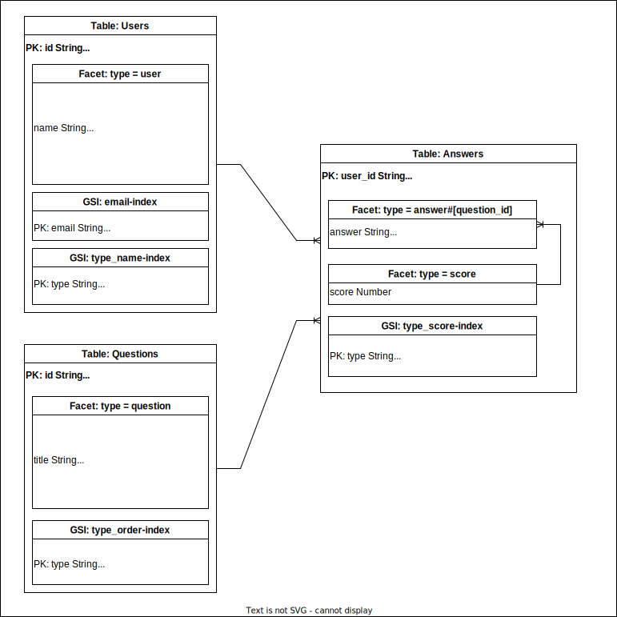

# DynamoDB ER Diagram
## What's this?
One idea for drawing an ER diagram in DynamoDB.  

## ER Diagram
It is drawn using [Draw.io](https://www.draw.io/).

## Explanation

As an example, I am drawing a problem with a user and drawing the data structure of a web application.  
  
This expression is used in consideration of the fact that there is not one data schema in one table and that there are multiple GSIs.

